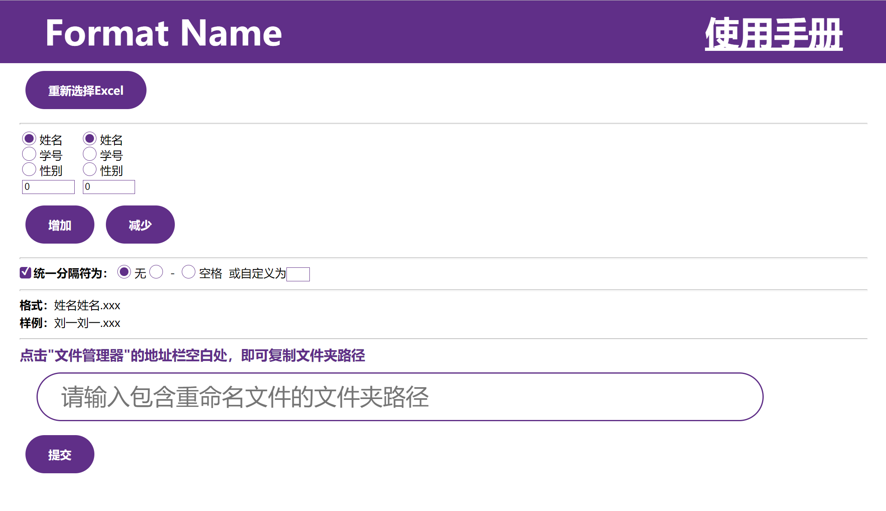

# 格式化命名（Format Name）

## 作用

通过excel花名册名单，对上交的作业进行固定格式的重命名

## 介绍

从excel文件里读取数据，并将表头作为选项，排列出合适的命名方式，按照选定的关键字，将指定文件夹中的文件重命名。

因此只要有一个班级的excel花名册，就可以一键重命名收集到的文件！

[更新日志](https://cxh1205.gitee.io/formatname/updata.html)

## 开发理念

老师要求手机文件按照“学号+姓名”命名，但是总有同学不按照规则来，交上来的文件五花八门，有“姓名+学号”的，有的只有学号或者姓名，甚至还有的只是一个“新建文本文档.txt”，要一个一个改名字就很烦，所以开发了这个程序。

## 特色功能

1. 可视化选择关键字
2. 新旧名称对比
3. 不会更改后缀名
4. 展示未交的文件名
5. 展示交重复的文件名
6. 可自定义格式
7. 可自定义分隔符

## 注意事项

1. 目前仅支持以 **(.xlsx)(.xlsm)(.xltx)(.xltm)** 为后缀名文件
2. 列表需有2列以上数据 **（待修复）**

## 使用手册

### 名词解释

1. **选项**：指选择命名格式时可以选择的项
2. **关键字**：重命名时将根据旧名字中包含的关键字来匹配新名字，表格中选项重复最少的关键字优先级最高

### excel的选取

选择的表格内容应包含标题或者不包含标题，如图：

其中表头将作为**关键字**

excel路径获取方式：按住**shift**右键点击excel文件，选择“复制为路径”。

* 列表需有2列以上数据 **（待修复）**

### 选择关键字

点击表头选择是否作为关键字，鼠标放在表头上面会显示不能作为关键字的原因，，紫色的即为关键字。

### 选择格式

可以点击 **`统一分隔符`** 来选定是否统一，可以在输入框里自定义选项和分隔符。

* 如需自定义**数字**的格式，建议取消勾选 **`统一分隔符`** ，先采用自定义分隔符实现 **（待修复）**

### 数据分析

将新旧名称进行对比，同时展示没有交的文件以及重复的文件。

点击没有交的文件以及重复的文件即可复制文件名到剪贴板。