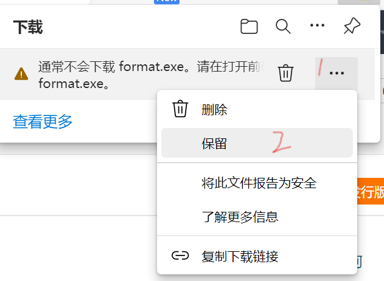
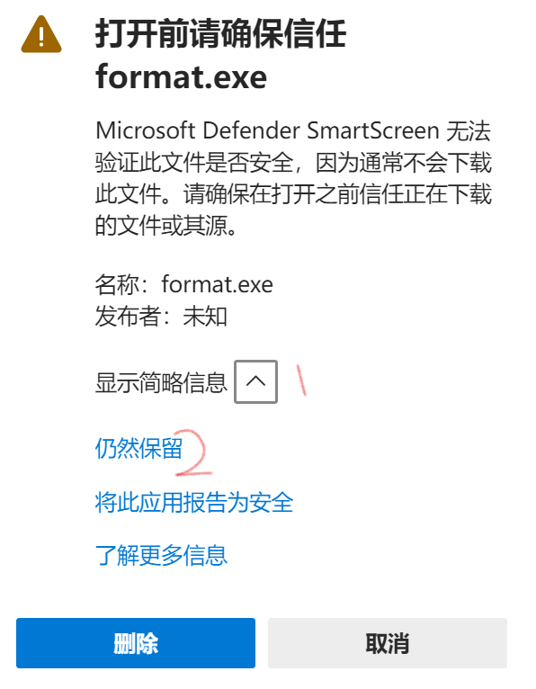
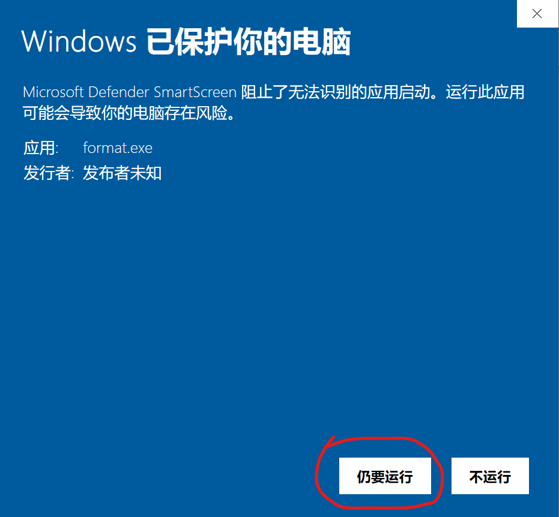

# 格式化命名（Format Name）

[gitee下载地址（快速）](https://gitee.com/cxh1205/FormatName/releases/v2.4.0)

[github下载地址](https://github.com/cxh1205/FormatName/releases/latest)

[不允许下载使用？](#unable)

## 功能

通过excel花名册名单，对上交的作业进行固定格式的重命名

## 介绍

从excel文件里读取数据，并将表头作为选项，排列出合适的命名方式，按照选定的关键字，将指定文件夹中的文件重命名。

因此只要有一个班级的excel花名册，就可以一键重命名收集到的文件！

[更新日志](https://cxh1205.gitee.io/formatname/update.html)

## 开发原因

有时候老师要求收集文件按照“学号+姓名”命名，但是总有同学不按照规则来，交上来的文件五花八门，有“姓名+学号”的，有的只有学号或者姓名，甚至还有的只是一个“新建文本文档.txt”，要一个一个改名字就很烦，因此开发了这个程序。

## 特色功能

1. 可视化选择关键字
2. 新旧名称对比
3. 不会更改后缀名
4. 展示未交的文件名
5. 展示交重复的文件名
6. 可自定义格式
7. 可自定义分隔符

## 使用手册

### 注意事项

1. 
目前仅支持以 **(.xlsx)(.xlsm)(.xltx)(.xltm)** 为后缀名文件

2. 
本程序不应该和要改名的文件放在一个文件夹里

<strong>名词解释</strong>

1. **选项**：指设置命名格式时可以选择的项
2. **关键字**：重命名时将根据旧名字中包含的关键字来匹配新名字，表格中选项重复最少的关键字优先级最高

### 第一步：excel的选取

选择一个excel表格作为数据源

表格第一行为表头，第二行开始为数据，如图：

其中表头将作为**关键字**

excel路径获取方式：

1. 打开execl所在的文件夹
2. 按住**shift**键，用鼠标右键点击excel文件打开菜单
3. 选择“复制为路径”或者复制文件地址

### 第二步：选择关键字

点击表头选择是否作为关键字，呈现出<strong style="color:purple">紫色</strong>的即为关键字，鼠标放在字段上面会显示系统判断这个字段不能作为关键字的原因。

### 第三步：选择格式

可以点击 ✅ <strong style="color:purple">统一分隔符</strong>来选定是否统一

可以在输入框里自定义选项和分隔符

选择确定后将进入数据分析

### 第四步：数据分析

将新旧名称进行对比，同时展示没有交的文件以及重复的文件。

点击<strong style="color:purple">未交</strong>或<strong style="color:purple">重复</strong>列表里的的文件名，即可将该文件名复制到剪贴板。

<strong>工作原理</strong>

根据选择出来的关键字列表，在文件夹列表中去寻找这个关键字。

（关键字的优先级通过关键字包含的值的重复次数来计算，重复次数越少，优先级越高）

如果找到了，就为这个文件更改名字，如果没找到，就继续扫描列表寻找下一个关键字。

直到所有的关键字用完，此时呈现未找到的文件名。

<strong id="unable">不允许下载？</strong>

1. 点击 **···** 选择**保留**

2. 选择**显示简略信息**，点击**仍然保留**

3. 打开时提示蓝框？点击**详细信息**，再点击**仍要运行**

